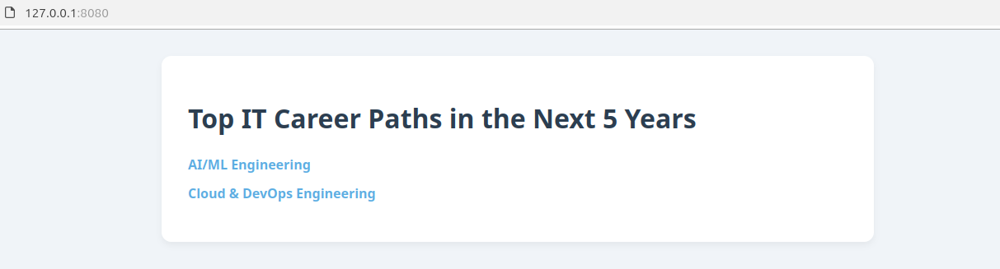

# IT Career Paths Web App

A simple Go web application that uses the `net/http` package to serve HTTP requests.
It showcases top IT career paths for the next 5 years and includes dedicated pages for each path with explanations and useful resources.

## 🚀 Features
- Homepage listing top IT career paths
- Dedicated pages for:
  - AI/ML Engineering
  - Cloud & DevOps Engineering
- Organized using HTML templates
- Serves static files (CSS styling)
- Basic HTTP handler tests

## 📁 Project Structure
```
/go-web-app-static
  ├── main.go
  ├── main_test.go
  ├── go.mod
  ├── templates/
  │    ├── home.html
  │    ├── ai-ml-engineering.html
  │    └── cloud-devops-engineering.html
  └── static/
       └── style.css
```

## 🛠 Getting Started

### 1. Clone the repository
```bash
git clone https://github.com/<your_github_username>/go-web-app-static.git
cd your_repo_name
```


### 2. Run the app
```bash
go run main.go
```
The app will be available at: http://localhost:8080

### 3. Run tests
```bash
go test
```
### Looks like this


### 📚 Future Improvements
- Add more IT career paths
- Improve page design and responsiveness
- Deploy the app to a cloud platform
